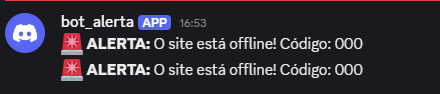
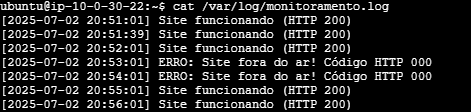

# Projeto-Linux-Compass
Projeto de configuração de servidor web com monitoramento e alertas automatizados

## Objetivo do Projeto
O objetivo deste projeto foi desenvolver e testar habilidades em Linux, AWS e automação através da configuração de um ambiente de servidor web Nginx monitorado, que envia alertas em caso de falha.

## Ferramentas e Tecnologias Utilizadas
* **Cloud:** AWS (EC2, VPC, Security Groups)
* **Sistema Operacional:** Linux (Ubuntu Server 24.04 LTS)
* **Servidor Web:** Nginx
* **Linguagem de Script:** Bash Scripting
* **Automação:** Cron (Agendador de Tarefas)
* **Alertas:** Discord Webhooks

---

## Etapas de Implementação

### Etapa 1: Configuração do Ambiente na AWS

O processo de criação da infraestrutura no console da AWS seguiu os seguintes passos:

**1. Criação da Rede (VPC):**

* No console da AWS, foi acedido o serviço **VPC**.
* Foi selecionada a opção **"Criar VPC"** e, em seguida, o assistente **"VPC e mais"** para automatizar a criação dos componentes.
* As configurações aplicadas foram:
    * **Nome:** `projeto-final-vpc`
    * **Zonas de Disponibilidade (AZs):** `2`
    * **Número de sub-redes públicas:** `2`
    * **Número de sub-redes privadas:** `2`
    * **Gateways NAT:** `Nenhum`
    * **Endpoints da VPC:** `Gateway do S3`
* Após a confirmação, o assistente criou a VPC, as 4 sub-redes, um **Internet Gateway** e as tabelas de rotas necessárias.

**2. Criação do Servidor (Instância EC2):**

* No console da AWS, foi acedido o serviço **EC2**.
* Foi selecionada a opção **"Executar instância"**.
* As configurações aplicadas foram:
    * **AMI (Sistema Operacional):** `Ubuntu Server LTS`
    * **Tags**(escolha do usuario)
    * **Tipo de Instância:** `t2.micro` 
    * **Par de Chaves (Login):** Foi criado um novo par de chaves do tipo `RSA` e formato `.pem`, que foi descarregado e guardado em segurança para permitir o acesso SSH.
    * **Configurações de Rede:** A instância foi associada à **VPC** `projeto-final-vpc` e colocada numa das **sub-redes públicas**. A opção para atribuir um IP público automaticamente foi ativada.
    * **Firewall (Grupo de Segurança):** Foi criado um novo Security Group com as seguintes regras de entrada:
        * Permitir tráfego **SSH** (porta 22) para qualquer lugar (0.0.0.0/0)
        * Permitir tráfego **HTTP** (porta 80) para qualquer lugar (0.0.0.0/0)

* Finalmente, a instância foi executada clicando em **"Executar instância"**.

#### Acesso Remoto Seguro com SSH

Após a criação bem-sucedida da instância EC2, o passo seguinte foi estabelecer uma conexão remota segura para poder instalar e configurar o servidor web. Para isso, foi utilizado o protocolo **SSH (Secure Shell)**.

O acesso foi realizado a partir de um terminal local (Windows PowerShell), seguindo estes passos:

**1. Pré-requisitos:**
* A instância EC2 estava no estado "Em execução" (Running).
* O **Endereço IPv4 Público** da instância foi copiado do painel da AWS.
* O ficheiro da chave privada (**`.pem`**), criado e baixado durante a criação do Par de Chaves, estava guardado num local seguro no computador local.

**2. Navegação para a Pasta da Chave:**
No terminal local, foi utilizado o comando `cd` para navegar até à pasta onde o ficheiro `.pem` estava guardado.
```bash
cd Downloads
````

**3. Execução do Comando de Conexão:**

A conexão foi estabelecida com o seguinte comando(exemplo), que utiliza a chave privada para a autenticação em vez de uma senha:

```bash
# Estrutura: ssh -i "ficheiro-da-chave.pem" utilizador@ip-publico
ssh -i "suachave.pem" ubuntu@SEU_IP_PUBLICO_DA_AWS
```

Os componentes deste comando são:

  * **`ssh`**: O programa cliente que inicia a conexão.
  * **`-i "suachave.pem"`**: A flag `-i` (de identidade) que aponta para o ficheiro de chave privada a ser usado na autenticação.
  * **`ubuntu`**: É o nome de utilizador padrão para as imagens oficiais do Ubuntu Server na AWS.
  * **`@SEU_IP_PUBLICO_DA_AWS`**: O endereço público do servidor na nuvem.

**4. Confirmação de Autenticidade do Host:**

Na primeira vez que se conecta a um novo servidor, o cliente SSH exibe a "impressão digital" (fingerprint) do servidor e pede uma confirmação de confiança. Foi digitado `yes` para aprovar a conexão e adicionar o servidor à lista de hosts conhecidos. Esta é uma medida de segurança importante contra ataques "man-in-the-middle".

*Exemplo da confirmação de autenticidade:*


### Etapa 2: Configuração do Servidor Web

Com o acesso SSH estabelecido, o passo seguinte foi a instalação e configuração do servidor web Nginx para exibir uma página HTML personalizada.

**1. Instalação do Nginx:**
O servidor foi primeiramente atualizado para garantir que todos os pacotes estivessem na sua versão mais recente, uma boa prática de segurança. Em seguida, o Nginx foi instalado utilizando o gestor de pacotes `apt`.

```bash
# Atualiza a lista de pacotes do sistema
sudo apt update

# Instala as atualizações pendentes
sudo apt upgrade -y

# Instala o Nginx
sudo apt install nginx -y
```
* Após a instalação, foi verificado o estado do serviço para garantir que ele estava a funcionar. O serviço Nginx geralmente inicia automaticamente, mas é uma boa prática confirmar.
    ```bash
    # Verifica o estado atual do Nginx
    sudo systemctl status nginx
    ```
*Verifique digitando "Endereço IPv4 público ex:3.141.34.169

* Para garantir que o serviço Nginx inicie sempre que o servidor for ligado, o seguinte comando foi executado para o habilitar:
    ```bash
    # Habilita o Nginx para iniciar no boot
    sudo systemctl enable nginx
    ```

**2. Criação da Página Personalizada:**

* A página padrão do Nginx foi substituída por um ficheiro `index.html` personalizado, criado em `/var/www/html/`.
* O comando `sudo nano /var/www/html/index.html` foi usado para criar e editar o ficheiro com o seguinte conteúdo:

    ```html
    <!DOCTYPE html>
    <html lang="pt-br">
    <head>
        <title>Projeto DevSecOps</title>
        <style>
            body { font-family: sans-serif; text-align: center; margin-top: 50px; }
        </style>
    </head>
    <body>
        <h1>Meu Projeto Linux - DevSecOps na AWS!</h1>
        <p>Servidor Nginx configurado com sucesso!</p>
    </body>
    </html>
    ```
---
### Etapa 3: Script de Monitoramento e Automação

Com o servidor web funcional, o foco passou a ser a criação de um sistema de monitoramento

#### 1. Desenvolvimento do Script

Foi desenvolvido um script em Bash, chamado `monitor.sh`, com uma lógica simples e eficaz:
* Verificar o status HTTP do site a cada execução.
* Registar o resultado (sucesso ou falha) com data e hora num ficheiro de log.
* Em caso de falha, enviar um alerta para um canal de comunicação.
para escrever digite: `nano monitor.sh`
* **Código Final (`monitor.sh`):**
    ```bash
    #!/bin/bash

    # Configs básicas
    site="(http://127.0.0.1)"
    log="/var/log/monitoramento.log"
    # A URL real do webhook foi removida por segurança
    webhook="SUA_URL_DO_DISCORD_AQUI"

    # Data e hora atual
    data=$(date "+%Y-%m-%d %H:%M:%S")

    # Testa o site e pega o status HTTP
    status=$(curl -s -o /dev/null -w "%{http_code}" "$site")

    if [ "$status" -eq 200 ]; then
        echo "[$data] Site funcionando (HTTP $status)" >> "$log"
    else
        echo "[$data] ERRO: Site fora do ar! Código HTTP $status" >> "$log"
        msg="🚨 **ALERTA:** O site está offline! Código: $status"
        curl -s -X POST -H "Content-Type: application/json" -d "{\"content\": \"$msg\"}" "$webhook"
    fi
    ```

#### 2. Configuração do Sistema de Alertas (Discord Webhook)


Um webhook é uma URL que funciona como um "endereço de entrega" para mensagens. O processo de configuração foi o seguinte:

1.  **Criação do Canal:** Um novo canal de texto (ex: `#alertas-servidor`) foi criado no servidor do Discord.
2.  **Acesso às Integrações:** Nas configurações do canal, foi selecionada a opção "Integrações".
3.  **Criação do Webhook:** Foi utilizada a opção "Criar Webhook". O Discord gerou um bot e uma URL única.
4.  **Obtenção da URL:** A "URL do Webhook" foi copiada. É esta URL que foi inserida na variável `webhook` do script para direcionar os alertas.

#### 3. Automação com Cron

Para cumprir o requisito do projeto de executar o monitoramento **a cada 1 minuto**, foi utilizada a ferramenta padrão do Linux, o `cron`. A configuração foi feita da seguinte forma:

1.  **Edição do Crontab:** O comando `crontab -e` foi executado no terminal para abrir o ficheiro de agendamento de tarefas do utilizador.
2.  **Adição da Tarefa:** A seguinte linha foi adicionada ao ficheiro para definir a automação:
    ```
    * * * * * /bin/bash /home/ubuntu/monitor.sh > /dev/null 2>&1
    ```
    * `* * * * *`: Define a execução para "a cada minuto".
    * `/bin/bash ...`: Especifica o comando a ser executado.
    * `> /dev/null 2>&1`: Redireciona toda a saída do script para o "vazio", uma boa prática para evitar notificações desnecessárias do sistema `cron`.
3.  **Ativação:** Ao salvar o ficheiro, a tarefa foi ativada instantaneamente pelo sistema, garantindo o monitoramento contínuo.


#### 4. Configuração e Verificação dos Logs

Um passo crucial para o funcionamento do script foi a correta configuração do ficheiro de log, que deve ser armazenado em um local no servidor.

* **Localização do Log:** Conforme definido no script, os registos são guardados em `/var/log/monitoramento.log`.

* **Configuração de Permissões:** O diretório `/var/log` é uma área protegida do sistema. Para que o script, executado pelo `cron`, pudesse escrever neste local, foram necessários os seguintes comandos para criar o ficheiro e atribuir a permissão correta ao utilizador `ubuntu`:
    ```bash
    # Cria o ficheiro de log vazio
    sudo touch /var/log/monitoramento.log
    
    # Define o utilizador 'ubuntu' como o dono do ficheiro
    sudo chown ubuntu:ubuntu /var/log/monitoramento.log
    ```

* **Visualização dos Logs:** Para verificar os registos em tempo real, o comando `tail -f` foi utilizado, enquanto o comando `cat` serviu para exibir o conteúdo completo do ficheiro.
    ```bash
    # Observa o log em tempo real
    tail -f /var/log/monitoramento.log
    ```
---
### Etapa 4: Testes de Validação e Conclusão

Para validar que a solução completa era robusta e funcional, foi executada uma série de testes no ambiente da AWS, simulando cenários de operação normal e de falha, conforme solicitado pelo projeto.

#### Teste 1: Simulação de Falha do Serviço

* **Ação Realizada:** O serviço Nginx foi parado manualmente no servidor com o comando `sudo systemctl stop nginx` para simular uma falha inesperada do servidor web.
* **Resultado Verificado:**
    1.  **Alerta Imediato:** Na execução seguinte do script de monitoramento, uma notificação de alerta foi recebida com sucesso no canal configurado no Discord.
    2.  **Registo de Log:** O ficheiro `/var/log/monitoramento.log` foi atualizado com uma nova linha, registando a "FALHA" e o código de status correspondente.

*Exemplo do Alerta Recebido no Discord:*


#### Teste 2: Simulação de Recuperação do Serviço

* **Ação Realizada:** O serviço Nginx foi iniciado novamente com o comando `sudo systemctl start nginx`, simulando a recuperação do serviço.
* **Resultado Verificado:**
    1.  **Fim dos Alertas:** Nenhuma nova notificação de falha foi enviada.
    2.  **Registo de Log:** Na execução seguinte do script, o ficheiro de log foi atualizado com uma nova linha, desta vez registando "Site funcionando", confirmando que o sistema de monitoramento detetou a normalização do serviço.

*Exemplo do Ficheiro de Log com funcionamento e Falha(Oflline):*


